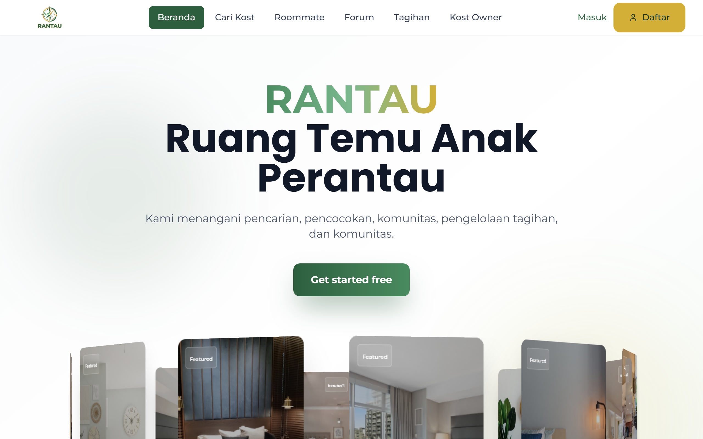

# RANTAU — Ruang Temu Anak Perantau 🌏


**RANTAU** is a web platform built for students and workers living away from their hometown. It brings four things that are normally scattered across group chats and spreadsheets into one place: finding a boarding house (*kost*), finding a compatible roommate, splitting shared bills, and a community forum for everything else.

Built as our team entry for the **PRISMA Competition 2025**.



## ✨ Features

### 🏠 Smart Kost Finder

More than a listing page. It helps you actually decide where to live.

- **Interactive map** for exploring kost locations, powered by Leaflet
- **Personalised quiz** that recommends places based on budget, campus, and facilities
- **Detailed filters** for price, facilities, distance to campus, and rating
- **Direct chat** simulation with the property owner

### 🤝 Roommate Matcher

Find someone you can actually live with, before you sign anything.

- **Compatibility algorithm** that scores lifestyle fit across sleep schedule, cleanliness, sociability, and study habits
- **Match percentage** shown between users
- **Verified profiles** with student verification status

### 💸 Bill Splitter (Tagihan Kost)

Shared finances without the awkward conversations.

- **Automatic splitting** for electricity, water, internet, and other shared costs
- **Payment tracking** so everyone can see who has settled up
- **Due date reminders**

### 💬 Community Forum

- **Categories** covering budget tips, scholarship info, part-time jobs, kost reviews, and events
- **Trending topics**

### 🏢 Kost Owner Dashboard

For the property owners themselves, most of whom are small businesses.

- **Property management** to add and edit listings
- **Analytics** for listing performance and room occupancy

## 🛠 Built with

- **[React](https://react.dev/)** (v19)
- **[Vite](https://vitejs.dev/)** for the dev server and build
- **[Tailwind CSS](https://tailwindcss.com/)** for styling
- **[Framer Motion](https://www.framer.com/motion/)** for page transitions and UI interactions
- **[Leaflet](https://leafletjs.com/)** and **[React Leaflet](https://react-leaflet.js.org/)** for maps
- **[React Router](https://reactrouter.com/)** for routing
- **[Lucide](https://lucide.dev/)** for icons

## 🚀 Running it locally

Requires **Node.js 18** or newer.

```bash
git clone https://github.com/GianneAngely/Prisma-Competition-2025-Rantau.git
cd Prisma-Competition-2025-Rantau/rantau-website
npm install
npm run dev
```

Vite prints a local URL when it starts, usually `http://localhost:5173`.

## 📂 Project structure

```
rantau-website/
├── public/                      # Static assets (logo, favicon)
├── src/
│   ├── assets/                  # Component images and SVGs
│   ├── components/              # Reusable UI components
│   │   ├── Header.jsx           # Top navigation
│   │   ├── MobileBottomNav.jsx  # Bottom navigation (mobile)
│   │   ├── KostCard.jsx         # Kost listing card
│   │   ├── RoommateCard.jsx     # Roommate profile card
│   │   └── ...
│   ├── data/                    # Mock data
│   │   ├── kosts.js
│   │   ├── roommates.js
│   │   └── forumPost.js
│   ├── pages/                   # Application pages
│   │   ├── Home.jsx             # Landing page
│   │   ├── SmartKostFinder.jsx  # Kost search and map
│   │   ├── Roommate.jsx         # Roommate matching
│   │   ├── TagihanKost.jsx      # Bill management
│   │   ├── Forum.jsx            # Community forum
│   │   └── ...
│   ├── App.jsx                  # Root component and routing
│   ├── main.jsx                 # React entry point
│   └── index.css                # Global styles and Tailwind directives
├── tailwind.config.js
├── vite.config.js
└── package.json
```

## 💡 Walkthrough

**Finding a kost**
Open **Cari Kost**, then either use the filters on the left or hit "Mulai Survey Personal" for automatic recommendations. Click a pin on the map to see a quick summary.

**Finding a roommate**
Open **Roommate**, click "Mulai Cari Roommate", and answer a short questionnaire about sleep, cleanliness, and social habits. The system returns people ranked by compatibility, for example "93% Match".

**Managing bills**
Open **Tagihan** to see this month's costs split across housemates. Mark bills as paid or send a reminder.

## 📝 Note on the data

All listings, roommate profiles, and forum posts in this repo are **mock data** used for the competition demo. There is no backend, no database, and no real user accounts.

## 🌏 Note on language

The application interface is in Indonesian, since it was built for Indonesian users.

## 📄 License

Released under the **MIT License**.

```text
MIT License

Copyright (c) 2025 RANTAU Team

Permission is hereby granted, free of charge, to any person obtaining a copy
of this software and associated documentation files (the "Software"), to deal
in the Software without restriction, including without limitation the rights
to use, copy, modify, merge, publish, distribute, sublicense, and/or sell
copies of the Software, and to permit persons to whom the Software is
furnished to do so, subject to the following conditions:

The above copyright notice and this permission notice shall be included in all
copies or substantial portions of the Software.

THE SOFTWARE IS PROVIDED "AS IS", WITHOUT WARRANTY OF ANY KIND, EXPRESS OR
IMPLIED, INCLUDING BUT NOT LIMITED TO THE WARRANTIES OF MERCHANTABILITY,
FITNESS FOR A PARTICULAR PURPOSE AND NONINFRINGEMENT. IN NO EVENT SHALL THE
AUTHORS OR COPYRIGHT HOLDERS BE LIABLE FOR ANY CLAIM, DAMAGES OR OTHER
LIABILITY, WHETHER IN AN ACTION OF CONTRACT, TORT OR OTHERWISE, ARISING FROM,
OUT OF OR IN CONNECTION WITH THE SOFTWARE OR THE USE OR OTHER DEALINGS IN THE
SOFTWARE.
```
